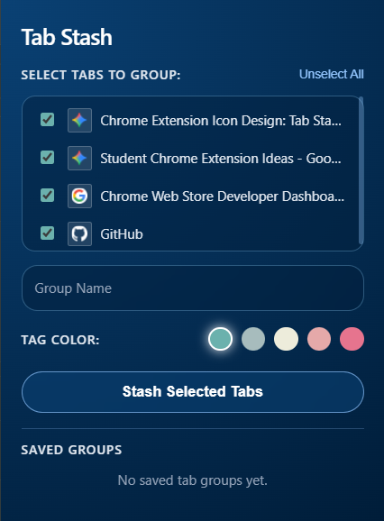

#  Tab Stash

> A minimalist, glassmorphic Chrome extension designed to stash open browser tabs into organized study sessions and restore them effortlessly with native tab grouping.




---

##  Overview

**Tab Stash** is built for students, researchers, and multi-taskers who deal with browser tab overload. Instead of keeping dozens of tabs open or cluttering your bookmarks, Tab Stash lets you selectively stash tabs into custom, saved sessions and instantly rebuild them as native Chrome Tab Groups whenever you're ready to focus.

---

##  Key Features

* **Selective Tab Stashing:** Choose exactly which tabs to stash using an intuitive checkbox workflow.
* **Native Tab Groups Integration:** Restores saved sessions directly as color-coded Chrome Tab Groups.
* **Session Management:** Save, name, and manage study or project sessions locally with pulsing status indicators for active groups.
* **Glassmorphic UI:** Features a sleek dark-mode design with translucent glass cards, backdrop blurs, and vibrant accent palettes (`Veranda Blue`, `Sky Cloud`, `Lychee`, `Melon`, `Cupid Pink`).
* **Privacy-First & Local:** All stashed sessions are stored locally on your device via `chrome.storage.local`. No external servers, tracking, or account creation required.

---

## 🛠️ Tech Stack

* **Manifest:** Manifest V3
* **Frontend:** HTML5, CSS3 (Glassmorphism & Flexbox/Grid), JavaScript (ES6+)
* **APIs Used:** `chrome.tabs`, `chrome.tabGroups`, `chrome.storage.local`, `chrome.favicon`

---

## 📂 Project Structure

```text
TabStash/
├── icons/
│   ├── icon16.png
│   ├── icon48.png
│   └── icon128.png
├── manifest.json
├── popup.html
├── popup.js
└── styles.css